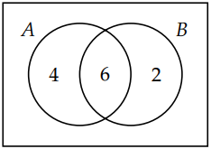

## Discrete Math Counting Chapter 1.1: Additive and Multiplicative Principles

Additive Principle: states that if event A can occur in m ways, and event B can occur in n disjoint ways then the event “A or B” can occur in m + n ways. \
^addition: You can also add more than two choices, "m + n + O" 

The multiplicative principle: if event A can occur in m ways, and each possibility for A allows for exactly n ways for event B, then the event “A and B” can occur in m * n ways. 

The first section had some things that required prior knowlege, how many 2 letter words with vowels, and whats inside of a deck of cards. 

Half naked day is crazy, in Example 1.1.6. 

Additive Principle with sets:\
Given two sets A and B, if A ∩ B  ∅ (that is, if there is no element in common to both A and B), then |A ∪ B|  |A| + |B|. 

Cartesian Product:\
Given sets A and B, we can form the set \
$$ A × B = {(x, y) : x ∈ A ∧ y ∈ B} $$
to be the set of all ordered pairs (x, y) where x is an element of A and y is an element of B. We call A × B the Cartesian product of A and B. 

When |A| = 10 AND |B| = 8 and |A ∩ B| = 6 teh Ven diagram will look like the following. \
 

Cardinality of a union with 2 sets: \
For any finite sets A and B, \
|A ∪ B|  |A| + |B| − |A ∩ B|. \
Cardinality of a union with 3 sets: \
For any finite sets A, B, and C, \
|A ∪ B ∪ C|  |A|+|B|+|C|−|A ∩ B|−|A ∩ C|−|B ∩ C|+|A ∩ B ∩ C|. 