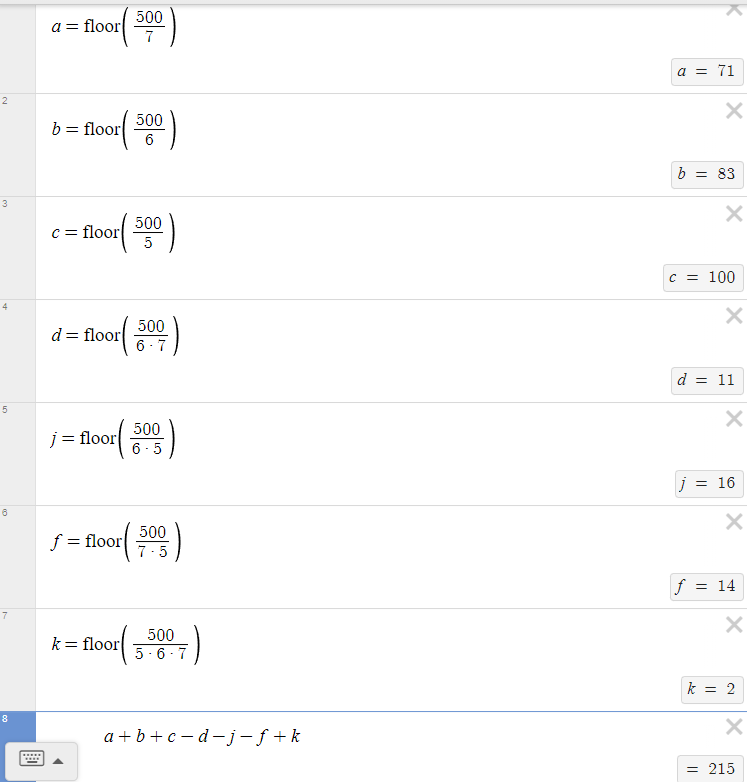

# Chapter 1.1 Solutions:
1. To get the answer you use the multaplicative principle and multiply 5, 3, and 17.
$$5 * 3 * 17 = 255$$
2. (a) You use additive principle to get 8 by adding 3 and 5.
$$3 + 5 = 8$$
2. (b) You use multiplicative principle to get 15 by multiplying 3 and 5.
$$3 * 5 = 8$$
2. (c) Dresses count as full outfits so you add them, and pants and skirts are bottoms and shirts are tops, so using multiplicative and additive principle you get 42.
$$(4+3) * 5 + 7$$
3. (a) This is the amount of movies you can pick from both genres.
$$9 + 7 = 16$$
3. (b) This the amount of combinations of 1 horror and 1 comedy movie you can watch.
$$9 * 7$$
4. (a) Waiting for presentation.

4. (b) Waiting for presentation.

4. (c) Waiting for presentation.

4. (d) Waiting for presentation.

5. (a) The max amount of intersecting values in the two sets is 10 because set A has 10.
5. (b) The smallest value of the intersecting values is 0 because the two sets don't have to have intersecting values.
5. (c) The smallest possible value of the union of set A and set B is 15 because set A could be a subsest of set B and the largest value of the union is 25 because they could share no values.
$$15 <=  |A ∪ B| <= 25$$
6. The addition of the two will always equal 13 because if they share all values the intersection will equal 5 and the union will equal 8, and if they share no values the intersection will equal 0 and the union will equal 13.
$$5 + 8 = 13$$
$$0 + 13 = 13$$
7. The answer is 39 because you subtract those who watched 2 movies from the total of movies watched and add the 8 who watched all three back to the total of watched movies to not count a subject twice (use a ven diagram if help is needed).
$$28+19+24−16−14−10+8  39$$
8. The answer is 6 because you subtract those who like potaties from the total surveyies and add those who liked two types of potatoes back to the total surveyies and subtract those who liked all three to not count a subject twice (use a ven diagram if help is needed).
$$30 - 15 - 20 - 9 + 12 + 5 + 6 - 3 = 6$$
9. Answer is 215, I don't want to explain the math so here is an image of desmos (look at 1.9's hint for help).

10. Waiting for presentation.
11. (a) ?
11. (b) ?
12. (a) There are 8 letters in the set a-h so we can raise 8 to the number of letters in each word, which is 5, which gives us 32768.
$$8^5 = 32768$$
12. (b) To find this, we just use the multaplicative principle and decrease the multiplied number by 1 each time until we have 4 which is one less that our given amount of letters to make a word with giving us 6720.
$$8 * 7 * 6 * 4 * 5 * 4 = 6720$$
12. (c) ?
12. (d) ?
12. (e) ?
13. ?
14. 735000 has 120 divisors $ 2^3 $ provides us with 4 factors to choose from as divisors $ 2^0 $, $ 2^1 $, $ 2^2 $, and $ 2^3 $, $ 3 $ provides us with 2 factors, $ 5^4 $ provides 5 factors, and $ 7^2 $ provides 3, to get the total number of divisors we multiply all the possible given factors 4, 2, 5, and 3.
$$4 * 2 * 5 * 3 = 120$$

[Textbook](https://discrete.openmathbooks.org/dmoi3.html)