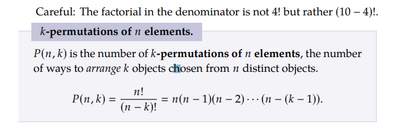
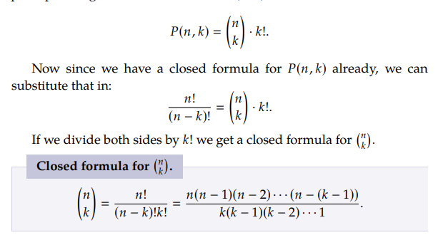

## Discrete Math Counting Chapter 1.3: Combinations and Permutations

A permutation is a rearangement of objects in different orders. For example,there are 6 permutations of the letters a, b, c:

$$abc, acb, bac, bca, cab, cba.$$

The amount of permutations for a set with distinct objects (every object is unique) is just the factorial of the length of the set. For example the number of permutations for a set with 6 objects is $6! =720$

When shortining the posibilitys of permutations to a number of elements for example a set of letters a through f and you are making 4 letter word combinaions you don't just use one factorial but instead do the following:
$$6*5*4*3 = 360$$
or

$$6!/2! = 360$$

