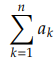

## Discrete Math Sequence Chapter 2.1: Describing Sequences

### Sequences:
Definition: A sequence is a simoly ordered list of numbers.

Example: 0, 1, 2, 3, 4, 5

#### How can you specify a sequence?

There are two ways:

1# Closed formula:

A closed formula for a sequence $(a_n)_n_∈_N$ is a formula for an using a
fixed finite number of operations on n. This is what you normally
think of as a formula in n, just as if you were defining a function in
terms of n (because that is exactly what you are doing).

2# Recursive defnition:

A recursive definition (sometimes called an inductive definition)
for a sequence $(a_n)_n_∈_N$ consists of a recurrence relation : an equation
relating a term of the sequence to previous terms (terms with smaller
index) and an initial condition: a list of a few terms of the sequence
(one less than the number of terms in the recurrence relation).

#### Common sequence types:

#### Representation:

You can represent a sequence by using the following notation/fromula.

