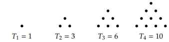

## Discrete Math Sequence Chapter 2.2:
### Arithmetic Sequences:
If the terms of a sequence are different by a constant, we can say the sequence is arithmetic. 

#### Recursive definition:

$a_n = a_{n-1} + d$ with $a_0 = a$

#### Closed Formula:

$a_n = a + dn$

to find a closed formula you do the following 

$$
a_0 = a \\
a_1 = a_0 + d = a + d\\
a_2 = a_1 +d = a + d + d = a + 2d\\
a_3 = a_2 d = a + 2d + d = a + 3d\\
$$

### Geometric Sequences:
A sequence is called geometric if the ratio between successive terms is constant. Suppose the initial term a0 is a and the common ratio is r. 

#### Recursive definition:

$a_n = ra_{n-1}$ with $a_0 = a$

#### Closed Formula:

$a_n = a * r^n$

#### Triangular numbers:

They are numbers that form equilatiral triangles when dotted out.

The sequence is the following:

$1, 3, 6, 10, 15, ...$

Things can become clearer when the numbers are written as the following:

$$
1 = 1\\
3 = 1 + 2\\
6 = 1 + 2 + 3\\
10 = 1 + 2 + 3 + 4\\
.           .\\
.           .\\
.           .\\
T_n = 1 + 2 + 3 + ... + n\\
$$
