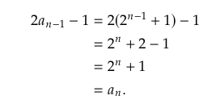
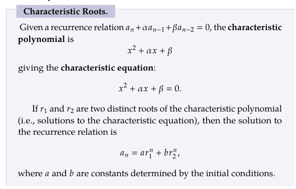
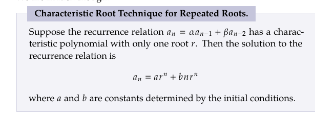

## Discrete Math Sequence Chapter 2.4:
### Recurrence relation:
Definition: A recurrence relation is a mathematical expression that defines a sequence recursively, meaning it describes how each term in the sequence depends on the preceding terms. In other words, it's a way of defining the terms of a sequence using previous terms in the sequence.

You can find these relations by looking at the change/difference between to objects in a set.

We can check solutions to a recurrence relation by plugging the solution into the recurrence relation.

For Example:

$a_n = 2^n + 1$ is a solution to the recurrence relation $a_n = 2a_{n - 1} - 1$ with $a_1 =3$.

We get the following proof by plugging it in:

This technique can be applied to different types of sequences that share a pattern.

### The Characteristic Root Technique:
This technique allows for us to make a recurrence relation into a polynomial as long as it presents itself as a combination of the two previous terms.

The following is a breakdown of the technique:

For recurrence relation that contain only one root that may bounce such as $(x-r)^2$ you can use the following technique:

