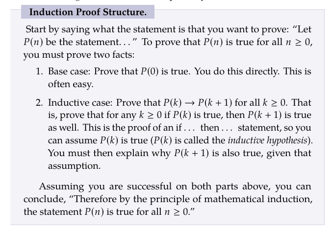
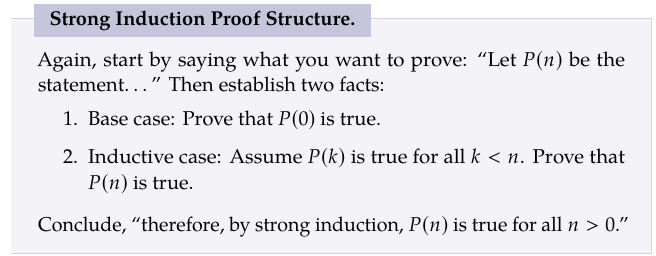

## Discrete Math Sequence Chapter 2.5:
### Induction Proof Structure:
Proofs allow you to check and prove your answer to a question asked previously.

Induction allows you to start a chain of checks rather than having to check each one yourslef.

Though induction is a poweful tool it can't solve all questions, so don't abuse it.

