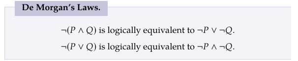
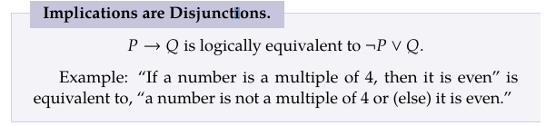
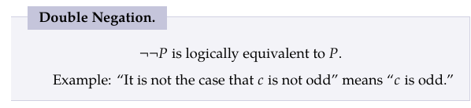
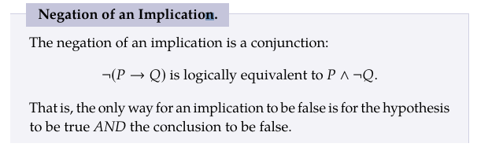

## Discrete Math Symbolic Logic and Proofs Chapter 3.1:
### Arguments:
Def: Arguments are a set of statements, one of the statements is a conclusion and the rest are premises to the conclusion.

An argument is valid if the conclusion is true, which means the premises are also true.

### Truth Tables:
def: a table that shows the truth-value of a compound statement for every truth-value of its component statements.

Refresher:

### Latex Symbols:

$\forall$ = \forall

$\neg$ = \neg

or = $\lor$ = \lor

and = $\land$ = \land

implication = $\implies$ = \implies

biconditional = $\iff$ = \iff

Logical Equivalence: Logical equivalence occurs when two statements are logically the same. You can check their equivalence by creating a truth table and looking at the results.

#### De Morgan's Laws:

#### Implications are Disjunctions:

#### Double Negations:

#### Negation of an Implication:

### Deductions:

Using truth tables we can deduct when a statement is true.
