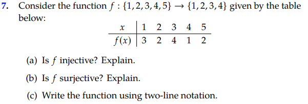

## Surjections, Injections, and Bijections
### What is a Surjection:
#### Definition:
In mathematics, a surjective function, also known as a surjection, is a function of f such that, for every number/element y of the function's codomain, there exists at least one number/element x in the function's domain such that f(x) = y.
#### Example:

### What is a Injection:
#### Definition:
In mathematics, a injective function, also known as a injection, is a function of f such that, for every number/element y or x of the function's codomain, there exists no more than one number/element x or y correspondingly in the function's domain such that x1 != x2 and f(x1) != f(x2). Additionally this ensures that the inverse, f(y), is also a function.
#### Example:

### What is a Bijection:
#### Definition:
Some may think that injections and surjections are opposites, but be careful: “surjective” and “injective” are NOT opposites.In mathematics, a bijective function, also known as a bijection, is a function of f such that, it complies with both the criteria of a surjection and a injection.
#### Example:

### Exercises and Solutions:

<b>Exersises</b>

Next part of the presentation is by [Fikir](https://github.com/StrwHatF1k1r/csc208/blob/main/Chapter_0.4_Presentation_(48-49).md).